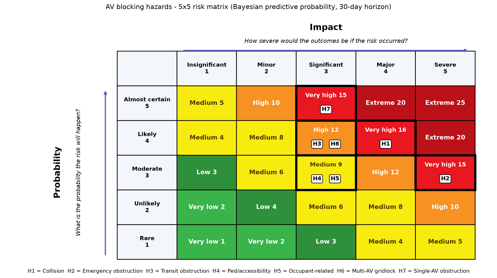

# AV Blocking Incident Analysis

**Authors:** Jonathan Wilson and Chujiang (CJ) Wu

Frequency, hazard classification, and risk-matrix placement of **autonomous-vehicle (robotaxi)
blocking incidents** in San Francisco: cases where a driverless vehicle becomes immobilized
and obstructs traffic, public transit, pedestrians, or emergency responders.

- **Website (paper, slides, notebook):** <https://jonathanwilsonami.github.io/av-blocking-analysis/>
- **Repository:** <https://github.com/jonathanwilsonami/av-blocking-analysis>



---

## Contents

- [Background](#background)
- [Objectives](#objectives)
- [Data](#data)
- [Methods in brief](#methods-in-brief)
- [Key results](#key-results)
- [Setup](#setup)
- [Reproducing the analysis](#reproducing-the-analysis)
- [Publishing the website](#publishing-the-website)
- [Repository layout](#repository-layout)
- [Extending the project](#extending-the-project)
- [Limitations](#limitations)
- [Acknowledgments](#acknowledgments)

---

## Background

Driverless ride-hail fleets operate at scale in San Francisco. When an AV cannot resolve a
situation, its fallback is to stop and wait for remote assistance or a field technician.
Typical triggers include an unusual intersection, a dark traffic signal, an emergency
scene, a passenger who will not leave, or a hardware or software fault. Stopping is safe
for the occupants, but a stopped AV can block lanes, Muni vehicles, crosswalks, and
emergency apparatus, sometimes for hours, and sometimes dozens of AVs at once. The San
Francisco Department of Emergency Management (DEM) records these events. This project turns
that log into defensible estimates of how often each kind of hazard occurs, how severe it
is, and where it sits on a standard 5×5 risk matrix.

## Objectives

1. **Hazard classification.** Design a defensible taxonomy and use it to engineer a hazard
   label from each free-text narrative (`Summary/Narrative`).
2. **Frequency.** Estimate incident and hazard frequencies, with uncertainty.
3. **Trends.** Test, with methods appropriate to a small, skewed sample, whether frequency,
   duration, or hazard mix is changing over time.
4. **Risk.** Place every hazard on a 5×5 red/yellow/green likelihood × consequence matrix,
   with a transparent account of its probability, impact, and resulting level.

## Data

| File | Sheet | Role |
|---|---|---|
| `data/AV-Brick-Report.xlsx` | `DEM Incidents` | **Primary source.** 123 records, Feb–Oct 2025 (120 in-scope blocking incidents): date, location, narrative, number of AVs, start and clear times. |
| `data/AV-Brick-Report-analyzed.xlsx` | `DEM Incidents` | Same incidents plus AV-company ETA, other parties, emergency-responder and transit-impact flags, and 8 extra records with narratives but no times (7 in scope). |
| | `DEM Incidents Quant` | Hand-coded neighborhood zone (1–10), multi-AV flag, time-of-day bins, duration flags. |
| | `plots and stats` | Monthly duration summaries, a six-group normality/rank-sum table, and a March-vs-October Mann–Whitney test. These are replicated and extended in the notebook. |
| `data/labels/manual_hazard_labels.csv` | – | Hand-coded audit label for every incident, with notes on ambiguous cases. |
| `data/labels/scope_exclusions.csv` | – | Records excluded as out of scope: reports of a *moving* AV (lane change, red light, erratic driving), and one record with no confirmed AV involvement. |
| `data/labels/weak_av_evidence.csv` | – | In-scope incidents whose narrative never names an AV (kept, flagged, and dropped in a sensitivity check). |
| `data/labels/evidence_flags.csv` | – | Team-reviewed evidence notes: collision/emergency labels whose consequence is inferred (each with a strict-reading alternative), and records whose effect is unknown. |
| `data/labels/blind_audit/` | – | Label-free coding packet (`coding_sheet.csv`, `CODING_GUIDE.md`) and the blind LLM second coder's labels (`llm_labels_codex.csv`, from OpenAI Codex, GPT-6-based). |
| `data/processed/zeroshot_{bart,deberta,embedding}.csv` | – | Cached predictions from the three pretrained models (optional methods): BART-large-MNLI, DeBERTa-v3-large NLI, mxbai embedding similarity. |

**Source and credit.** The incident records come from the **San Francisco Department of
Emergency Management (DEM)** dispatch log of AV-related incidents. **Much of the difficult
original data cleaning, compiling and coding raw dispatch records into these spreadsheets,
was performed by Dr. Missy Cummings.** This project builds directly on that work. The
`Legend` sheet documents the original field design (notes from Alex Demish, 5/12/2023).

**Known data issues** (all handled in code and discussed in the paper):

- **Coverage gaps.** February has only three incidents (Feb 1–3), and April and May are
  absent. Rates and trends use only the six fully covered months (184 days).
- **Truncation.** About two-thirds of narratives were cut at roughly 45–60 characters by
  the export, almost all of them before August.
- **Mixed time formats** and events crossing midnight. Durations are recomputed modulo
  24 hours. A duration is the **logged event time** (opened to cleared), not a measured
  delay to responders.
- **Scope.** Three records describe a moving AV behaving badly rather than an immobilized
  one, and one names no AV and has no AV count. All four are excluded from the blocking
  analysis and listed separately. Seven in-scope incidents never name an AV in their
  narrative. They are kept, because they come from the curated AV log, but flagged and
  tested in a sensitivity check.

## Methods in brief

| Step | Method | Code |
|---|---|---|
| Cleaning and joins | Time parsing, midnight-safe durations, joins to secondary sheets on (date, location) | `av_blocking.data` |
| Hazard taxonomy | 7 consequence-based classes (H1 collision, H2 emergency obstruction, H3 transit, H4 pedestrian/accessibility, H5 occupant, H6 multi-AV gridlock, H7 single-AV obstruction), assigned by severity-first precedence; contributing cause coded on a separate axis | `av_blocking.taxonomy` |
| Classifier selection | Transparent regex rules, compared with TF-IDF + logistic regression and TF-IDF + XGBoost (repeated stratified CV), zero-shot NLI (BART-large-MNLI, DeBERTa-v3-large), and embedding similarity (mxbai-embed-large), all against the manual audit labels; paired McNemar and bootstrap tests between methods | `av_blocking.nlp` |
| Label validation | Blind LLM second coder (Codex) given only the narratives and a written coding guide; Cohen's and Fleiss' κ; every disagreement reviewed | notebook §4.1, `data/labels/blind_audit/` |
| Impact | Incident-level 1–5 score = max(hazard consequence, duration band, cluster size) | `av_blocking.severity` |
| Frequency | Poisson rate with exact Garwood CI; Jeffreys Gamma posterior; posterior-predictive P(≥1 in 30 days) for the risk matrix (see note below) | `av_blocking.frequency` |
| Trends | Exact Mann–Kendall, Poisson homogeneity, exact conditional rate test, Poisson/NB GLM; Kruskal–Wallis, Mann–Whitney, Jonckheere–Terpstra, Spearman/Theil–Sen; permutation chi-square, Cochran–Armitage | `av_blocking.trends` |
| Risk matrix | Reference 5×5 template (bands, cell levels, colors); **risk-curve placement**: each observed impact tier is paired with its own frequency | `av_blocking.risk_matrix`, `av_blocking.frequency` |
| Export | Figures, captioned tables, text snippets, and inline variables for Quarto | `av_blocking.export` |

**Why a Bayesian probability for the risk matrix?** The matrix asks how likely at least
one incident is in the next 30 days. The Bayesian posterior predictive answers that
directly, and carries the uncertainty in rates estimated from only 3–6 incidents into the
probability. A frequentist plug-in instead treats the estimated rate as exact, and assigns
probability zero to hazards not yet observed. The Jeffreys prior keeps the result
data-driven. Classical exact intervals are still reported for every rate. In this data the
plug-in version gives the same placements, so the choice is principled rather than
decisive.

## Key results

- About **19 blocking incidents per 30 days** (95% CI 16–23), roughly one every 1.6 days.
  Median duration 24 minutes; 29% last an hour or more.
- **No statistically detectable trend** in incident rate (Mann–Kendall exact p = 0.86) or
  duration (Kruskal–Wallis p = 0.27).
- The hazard mix appears to shift after July (p = 0.008), but this coincides with
  narratives switching from truncated fragments to full text. It is treated as a recording
  artifact, not a behavior change.
- **Classifier comparison (macro-F1 against the manual audit):**
    - Rules: 0.98 (in-sample).
    - Frontier LLM given the coding guide (Codex): 0.95.
    - Embedding similarity: 0.63. It is the best method that uses no labels, significantly
      better than BART, and only weakly better than logistic regression.
    - TF-IDF + logistic regression: 0.45 (cross-validated).
    - Zero-shot BART-MNLI: 0.40.
    - Zero-shot DeBERTa-v3: 0.33. It is not significantly different from BART; both NLI
      models over-predict collisions.
- **Blind second coder:** OpenAI Codex (GPT-6-based) labeled all incidents from the
  written guide alone. On the 120 in-scope incidents it agreed with the manual audit on 116
  (κ = 0.95) and with the rules on 117 (κ = 0.96); Fleiss' κ across all three coders is
  0.964. All four
  disagreements are defensible judgment calls on truncated narratives, so the labels were
  kept unchanged.
- **Two kinds of red:** collisions and emergency obstruction are *Very high* because of their
  consequences (safety). Single-AV obstruction is *Very high* because of sheer volume
  (operations): an hour-long blockage happens about every 11 days. Its rating depends on
  the rubric's 60-minute cutoff for *Significant*; at 90+ minutes it is *High*.
- **Main caveat: emergency obstruction is mostly inferred.** Five of the six in-window
  emergency-obstruction incidents place the AV at a fire, crash, or shots-fired scene
  without stating that it blocked responders. H2's *Very high* rating follows the
  taxonomy's definition, under which an AV stuck inside an active emergency scene counts.
  Counting only explicitly stated obstructions, H2 is *Medium* (Unlikely × Major). No other
  hazard moves under that strict reading.
- **Robust to the labeler:** relabeling hazards with the manual audit leaves every
  risk-matrix placement unchanged.
- Risk-matrix placement (30-day horizon):

| Hazard | Cell | Level |
|---|---|---|
| H1 AV-involved collision | Likely × Major | Very high |
| H2 Emergency-response obstruction | Moderate × Severe | Very high (Medium on explicit evidence only) |
| H7 Single-AV traffic obstruction | Almost certain × Significant | Very high |
| H3 Transit / rail obstruction | Likely × Significant | High |
| H6 Multi-AV clustering / gridlock | Likely × Significant | High |
| H4 Pedestrian / accessibility obstruction | Moderate × Significant | Medium |
| H5 Occupant-related immobilization | Moderate × Significant | Medium |

The paper explains each placement and its sensitivity to modeling choices.

## Setup

### 1. Install uv

[uv](https://docs.astral.sh/uv/) manages Python, the virtual environment, and the
dependencies, which are pinned in `uv.lock`.

```bash
# macOS / Linux
curl -LsSf https://astral.sh/uv/install.sh | sh
# Windows (PowerShell)
powershell -ExecutionPolicy ByPass -c "irm https://astral.sh/uv/install.ps1 | iex"
```

Restart your shell, then check with `uv --version`.

### 2. Install Quarto (needed only to render the paper, slides, and site)

Download from <https://quarto.org/docs/get-started/> (version 1.5 or later; developed with
1.8). Check with `quarto --version`.

### 3. Create the environment

```bash
git clone https://github.com/jonathanwilsonami/av-blocking-analysis.git
cd av-blocking-analysis
uv sync            # creates .venv with Python 3.12, installs the package + dev tools (Jupyter, pytest, ruff)
```

`uv sync` installs the project in editable mode, so `import av_blocking` works in the
notebook and in scripts. Prefix commands with `uv run` (e.g. `uv run pytest`), or activate
the environment with `source .venv/bin/activate`.

> If you have a conda or other virtualenv active, uv prints a harmless `VIRTUAL_ENV ... does
> not match` warning and still uses the project's `.venv`. Run `conda deactivate` to
> silence it.

**Optional pretrained-model extra.** The pretrained-model comparison uses Hugging Face
`transformers` and `sentence-transformers` with CPU-only PyTorch. The models are large
downloads: about 1.6 GB for BART, 1.7 GB for DeBERTa, and 0.7 GB for the embedding model.
Their predictions are cached in `data/processed/`, so the extra is **not** needed to
reproduce the analysis:

```bash
uv sync --extra nlp
make zeroshot      # re-runs all three models (~20 min on CPU) and refreshes the caches
```

The models and their hazard descriptions are defined in `nlp.PRETRAINED_MODELS` and
`nlp.ZEROSHOT_LABELS`. To try another Hugging Face model, add an entry there and run
`nlp.run_zeroshot(df, key)`.

## Reproducing the analysis

Everything is driven by the `Makefile`:

```bash
make test        # unit tests for parsing, taxonomy rules, scoring, banding, trend tests
make analysis    # executes notebooks/av_blocking_analysis.ipynb top to bottom
make site        # renders paper (HTML), slides (Reveal.js), and website into project-site/docs
make all         # all three
make preview     # live preview of the website while editing
```

Without `make`:

```bash
uv run pytest -q
uv run jupyter nbconvert --to notebook --execute --inplace notebooks/av_blocking_analysis.ipynb
uv run jupyter nbconvert --to html notebooks/av_blocking_analysis.ipynb --output-dir project-site --output notebook
cd project-site && uv run quarto render
```

To work interactively: `uv run jupyter lab`, then open the notebook and pick the
*Python 3* kernel from `.venv`.

### How the notebook feeds the paper

The notebook writes all results into `project-site/` through `av_blocking.export`:

| Function | Output | Used in Quarto as |
|---|---|---|
| `save_fig(fig, "fig-x")` | `assets/figures/fig-x.png` | `{#fig-x}` |
| `save_table(df, "tbl-x", caption)` | `assets/tables/tbl-x.md` (+ `.csv`) | ``, cross-referenced as `@tbl-x` |
| `save_text(text, "name")` | `assets/snippets/name.md` | `` |
| `save_var("trend.mk_p", 0.86)` | `_variables.yml` | inline `` |

Re-running the notebook therefore updates every number, table, and figure in the paper and
slides with no manual copying.

### Paper and slides from one source

`project-site/paper.qmd` declares two formats: `html` (the paper) and `revealjs` (written
to `paper-slides.html`). Long-form prose sits in
`::: {.content-hidden when-format="revealjs"}` blocks, slide-only bullets in
`::: {.content-visible when-format="revealjs"}` blocks, and shared figures sit outside
both. `##` headings become slides. Quarto ignores `when-format` attributes placed on
headings or images, so wrap conditional headings and figures in a fenced div.

## Publishing the website

The existing GitHub Pages setup is kept as is. The workflow publishes the **committed**
`project-site/docs/` folder to the `gh-pages` branch on every push to `main`. It does not
run Python or Quarto in CI, so render locally and commit the output:

```bash
make all
git add project-site/docs project-site/assets project-site/_variables.yml notebooks/
git commit -m "Update analysis and site"
git push
```

The workflow file lives in `.github/workflows/gh-pages.yml`, the folder GitHub Actions
reads.

## Repository layout

```
.
├── pyproject.toml / uv.lock      # package metadata and pinned dependencies (uv)
├── Makefile                      # test / analysis / site targets
├── src/av_blocking/
│   ├── config.py                 # paths, covered months, horizon, probability bands
│   ├── data.py                   # load, clean, join primary + secondary sheets
│   ├── taxonomy.py               # hazard and cause definitions, rule classifier
│   ├── severity.py               # incident impact rubric and scoring
│   ├── frequency.py              # Poisson/Bayesian rates, risk-curve placement
│   ├── trends.py                 # non-parametric and count trend tests
│   ├── risk_matrix.py            # 5×5 template, banding, matrix plot
│   ├── nlp.py                    # supervised, zero-shot NLI, embedding classifier comparison
│   ├── plotting.py               # figure functions and style
│   ├── export.py                 # save_fig / save_table / save_text / save_var
│   └── analysis.py               # prepare(): one call to an analysis-ready table
├── notebooks/av_blocking_analysis.ipynb   # primary analysis (executed)
├── data/                         # raw workbooks, manual labels, cached predictions
├── tests/                        # pytest unit tests
├── project-site/                 # Quarto website project
│   ├── _quarto.yml, index.qmd, paper.qmd, references.bib, styles.css
│   ├── _variables.yml            # generated by the notebook
│   ├── assets/                   # generated figures, tables, snippets
│   └── docs/                     # rendered site (published to GitHub Pages)
└── .github/workflows/gh-pages.yml
```

## Extending the project

- **New data.** Append rows to the workbook, or point `config.RAW_PRIMARY` at a new file. If
  new months are fully covered, add them to `config.COVERED_MONTHS`, then run `make all`.
- **Exposure.** If fleet vehicle-miles or trips become available (e.g. CPUC quarterly
  reports), pass them as the exposure in `frequency.rate_summary` / `place_hazards` to get
  per-mile rates.
- **Taxonomy.** Hazards and patterns are plain data in `taxonomy.HAZARDS` and
  `taxonomy.RULES`. Add a test case in `tests/test_core.py` for every rule change, and
  re-check agreement against `manual_hazard_labels.csv`.
- **Supervised models.** Once a few hundred labeled narratives exist, the manual labels and
  `nlp.cross_validate_models` give a ready baseline for training a learned classifier.
- **Policy choices.** The risk horizon (`HORIZON_DAYS`) and probability band edges
  (`PROB_BAND_EDGES`) are set in `config.py`.

## Limitations

Rates are per calendar day, because the log has no mileage exposure. Incidents that never
reached DEM are missing, so frequencies are lower bounds. Truncated narratives push
incidents into the default class, which likely undercounts H1–H5. The taxonomy, rules, and
audit labels come from a single analyst. A blind LLM second coder agreed closely, but a
human second coder would be stronger evidence. Several inputs are judgments rather than
measurements: the taxonomy, the impact rubric (e.g. 60 minutes = *Significant*), the
30-day horizon, and the placement rule. All were fixed before the matrix was drawn, are
written in code, and are varied in the sensitivity analysis. The paper's "What is measured
and what is judged" section lists them. Risk matrices are inherently coarse (Cox, 2008),
so the underlying rates, intervals, and risk curves are published alongside each cell.

## Acknowledgments

- **Dr. Missy Cummings**, for compiling and performing much of the difficult original
  cleaning of the DEM AV incident records used here.
- **San Francisco Department of Emergency Management**, the original source of the incident
  data.
- The course team, for the 5×5 risk-matrix template (bands, cell levels, colors), adapted
  here in `av_blocking.risk_matrix`.
