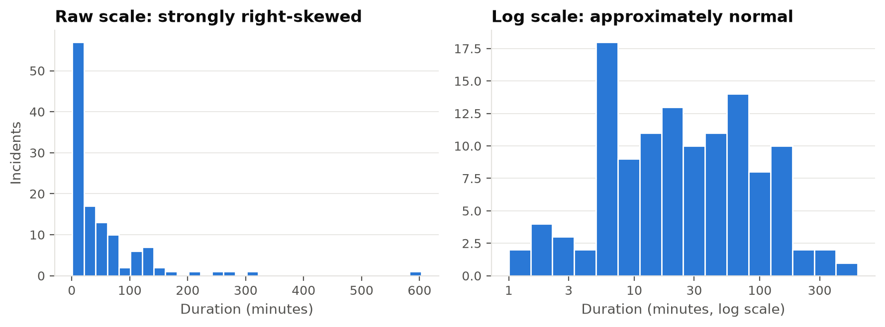
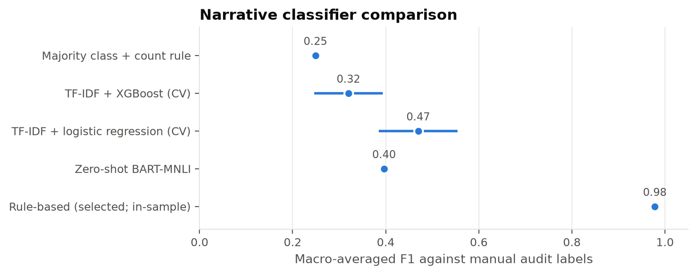
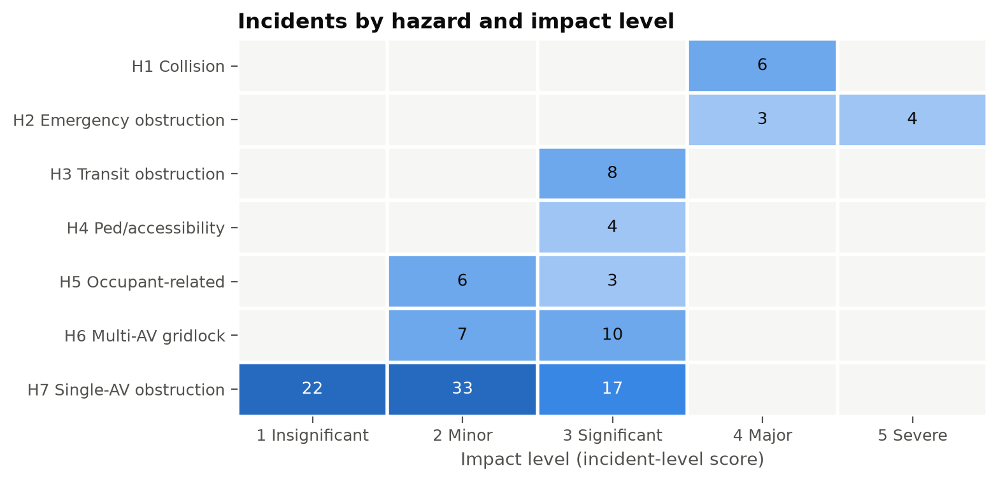
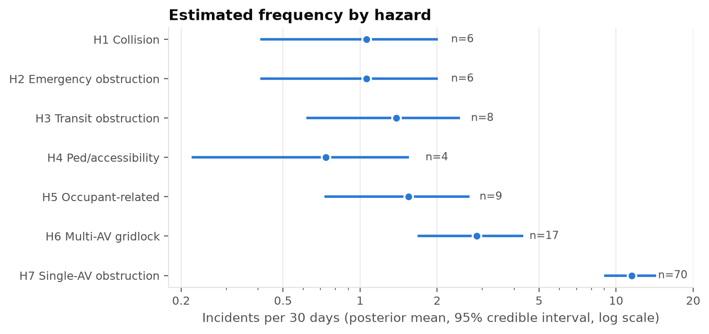
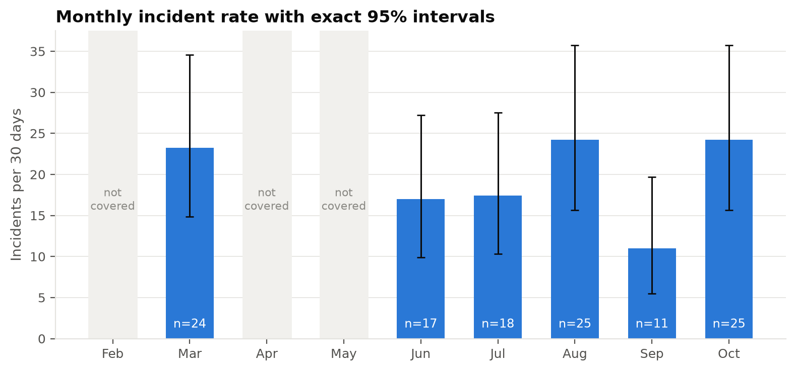
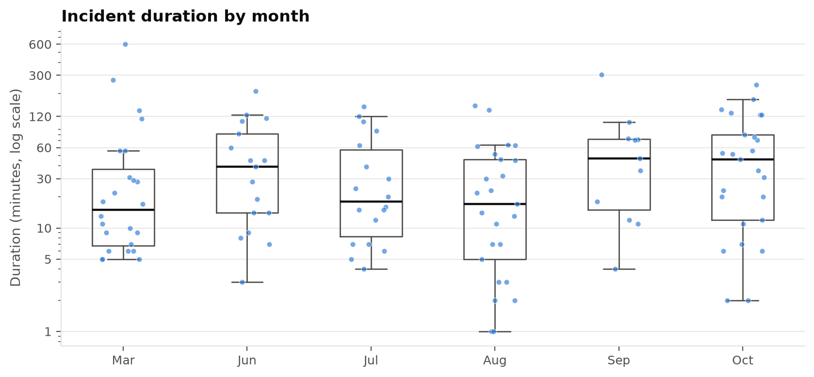
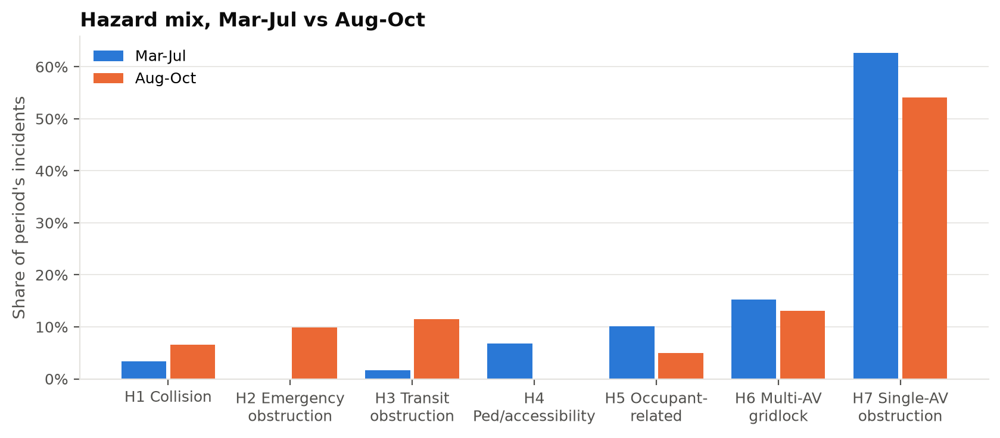

::: {.content-hidden when-format="revealjs"}
::: callout-note
## Reproducibility and data credit
Every number, figure, and table in this paper is produced by
`notebooks/av_blocking_analysis.ipynb` and exported to `project-site/assets/`. Inline
numbers are read from `_variables.yml`, so re-running the notebook updates the paper. The
incident records come from the San Francisco Department of Emergency Management. **Most of
the difficult original data cleaning was performed by Dr. Missy Cummings**, and this
analysis builds directly on that work.
:::
:::

# Introduction

::: {.content-hidden when-format="revealjs"}
Driverless ride-hail fleets now operate at scale in San Francisco. When an AV cannot resolve
a situation, the safe default is to stop and wait for remote assistance or a field
technician. That situation might be an unusual intersection geometry, a dark traffic
signal, an emergency scene, a passenger who will not leave, or a software or hardware
fault. A stopped vehicle is safe for its occupants but not necessarily for everyone else:
it can block lanes, transit, crosswalks, and emergency apparatus, often for long stretches.
City agencies record these events as **blocking incidents**.

This paper asks three questions of the DEM blocking-incident log:

1. **Frequency.** How often do blocking incidents, and each kind of hazard they create,
   occur, and how uncertain are those estimates?
2. **Hazard classification.** What hazards do these incidents create, and how can free-text
   dispatcher narratives be classified into them defensibly?
3. **Risk.** Where does each hazard sit on a standard 5×5 red/yellow/green risk matrix,
   and is anything changing over time?

The emphasis throughout is on conclusions that are statistically defensible given a small,
irregular, and imperfect sample.
:::

::: {.content-visible when-format="revealjs"}
## Motivation and questions

- Driverless robotaxis that cannot resolve a situation **stop and wait**. That is safe for
  occupants, but the stopped AV can block lanes, transit, crosswalks, and emergency vehicles.
- San Francisco DEM logged ** blocking incidents**,
   – .
- Questions:
    1. **How often** do incidents, and each hazard type, occur?
    2. **What hazards** do they create, and how can narratives be classified defensibly?
    3. **Where** does each hazard sit on a 5×5 risk matrix, and **is anything changing**?

*Data credit: SF DEM; original cleaning by Dr. Missy Cummings.*
:::

# Data

::: {.content-hidden when-format="revealjs"}
## Source and cleaning

The primary source is the `DEM Incidents` sheet of `AV-Brick-Report.xlsx`. Each record has
a date, location, free-text dispatcher narrative, number of AVs involved, and the times the
event started and cleared. The records originate with the San Francisco Department of
Emergency Management. Dr. Missy Cummings compiled and cleaned them from raw dispatch
records, which was the hard part.

We apply light, documented cleaning (@tbl-data-quality):

* parse the mixed time formats;
* compute duration as clear minus start, modulo 1,440 minutes, so events crossing midnight
  are handled;
* flag missing and truncated narratives;
* extract the operator;
* treat a missing AV count as at least one.



**Narrative truncation.**  of narratives
( of ) appear to have been cut at
about 45–60 characters by the export. This limits what any text classifier can recover, and
it turns out to matter for the trend analysis (@sec-mix).

**Coverage.** The log is not continuous. February holds only three incidents, all on its
first three days, and April and May are absent. Treating absent months as zero-incident
months would bias every rate and trend estimate. All rates and trend tests therefore use
the  fully covered months (March and June–October:
 days,  incidents). The February
incidents still count toward hazard classification and impact scoring. @sec-sensitivity
shows that the conclusions do not change if February is included.

## Secondary sheets and data engineering

The analyzed workbook (`AV-Brick-Report-analyzed.xlsx`) contributes four things:

* **Extra fields.** The AV company's ETA (given for 22 incidents; median 14.5 minutes),
  other parties involved, and emergency-responder and transit-impact flags. These are
  joined on date and location, and all 123 primary rows match.
* **A neighborhood zone (1–10)** hand-coded in `DEM Incidents Quant` (119 of 123 match).
  The same sheet's derived flags (multi-AV, 4-hour time-of-day bin, >20 / >40-minute
  durations) are recomputed from source fields.
* ** additional incidents** that have narratives but no
  times. They are excluded from duration analysis but used in a frequency sensitivity check.
* **The `plots and stats` sheet.** Monthly duration summaries, a six-group
  normality/rank-sum table, and a March-vs-October Mann–Whitney test (W = 377, p = 0.063).
  We replicate this result and extend it in @sec-trends.

The analyzed sheet's emergency-responder flag marks *responder involvement*, for example
police called to direct traffic around a stalled AV. It does not mark obstruction of an
emergency, so it is kept as a feature and does not define a hazard.
:::

::: {.content-visible when-format="revealjs"}
## Data at a glance

:::: columns
::: {.column width="48%"}
-  incidents; **** in the
   fully covered months ( days).
- Feb (3 incidents, days 1–3) and Apr–May (absent) are **coverage gaps, not zeros**, so
  they are excluded from rates.
-  of narratives are truncated at about 50 characters.
- Durations: median ** min** (95% CI –),
  90th percentile  min, max  min.
- Secondary sheets add ETA, neighborhood, and responder/transit flags, plus 8 extra
  incidents without times.
:::
::: {.column width="52%"}

:::
::::
:::

# Hazard taxonomy and narrative classification

::: {.content-hidden when-format="revealjs"}
## Design principles

A hazard is defined by its **consequence**: what the immobilized AV obstructed or put at
risk. Two design rules make the classes defensible.

1. **Consequence and cause are separate axes.** *Why* the AV stopped (a vehicle fault, a
   dark signal, a passenger, a routing edge case) is recorded separately as a contributing
   cause. Ad-hoc incident codes often mix the two, producing overlapping categories whose
   frequencies cannot be compared.
2. **Mutually exclusive and exhaustive, by precedence.** An incident can match several
   descriptions, for example two AVs stuck at a working fire. Each incident takes the
   *most severe* class it matches, in the order H1 > H2 > … > H7, with H7 as the default.
   Every incident therefore counts exactly once, and frequencies add up to the total.

H6 (multi-AV clustering) is a class of its own because several AVs failing together at one
site signals a **common-mode, fleet-level failure**, a mechanism distinct from one vehicle's
fault. It also takes a disproportionate share of road capacity. Single events in the log
involve up to 60 vehicles.


:::

::: {.content-visible when-format="revealjs"}
## Hazard taxonomy

| Code | Hazard | What the stopped AV obstructed / caused |
|---|---|---|
| H1 | AV-involved collision | contact with a vehicle, person, or animal |
| H2 | Emergency-response obstruction | medics, fire, police, or an active emergency scene |
| H3 | Transit / rail obstruction | Muni bus/rail, cable car, tracks |
| H4 | Pedestrian / accessibility | crosswalk, curb ramp, bike lane |
| H5 | Occupant-related | asleep/unresponsive rider, door left open, trapped occupant |
| H6 | Multi-AV gridlock | 2+ AVs stuck together (common-mode failure) |
| H7 | Single-AV obstruction | general traffic only (default) |

- **Consequence, not cause.** The cause (fault, dark signal, passenger, …) is coded on a
  separate axis.
- **Severity-first precedence** (H1 > … > H7) makes the classes mutually exclusive, so
  frequencies add up.
:::

::: {.content-hidden when-format="revealjs"}
## Classification method {#sec-classification}

Choosing a classifier is a question of fit to the data. The data here are 123 short,
often truncated narratives written in dispatcher shorthand (`blkng`, `ntfyd`, `LP`). There
are no gold-standard labels, and the safety-relevant classes have only 4–9 examples. We
compared four approaches:

* **Transparent rules**: keyword and regular-expression patterns plus the AV-count field,
  implemented in `av_blocking.taxonomy`.
* **Supervised TF-IDF models**: word and character n-grams with multinomial logistic
  regression, and with XGBoost [@chen2016].
* **Zero-shot NLI transformer**: BART-large-MNLI [@lewis2020; @yin2019], scoring each
  narrative against plain-language hazard descriptions.
* **Majority-class baseline.**

Fine-tuning a transformer was not attempted. With so few examples it would overfit, and
the result could not be audited.

As a reference, every narrative was read and hand-coded, with notes on ambiguous cases
(`data/labels/manual_hazard_labels.csv`). Agreement between the rules and the manual labels
is  (Cohen's $\kappa$ = ) [@cohen1960], where

$$
\kappa = \frac{p_o - p_e}{1 - p_e},
$$

$p_o$ is the observed agreement and $p_e$ the agreement expected by chance from the label
margins. The rules were written by the same analyst who made the reference labels, so this
figure is an internal-consistency check, not an independent validation. The one remaining
disagreement is a genuinely ambiguous crash scene (@tbl-disagreements).

The learned models are scored out-of-sample, by 4-fold × 5-repeat stratified
cross-validation (@tbl-classifiers, @fig-classifiers). They improve only modestly on the
majority baseline: macro-F1  for logistic regression and
 for XGBoost, against  for the baseline.
Logistic regression's F1 on emergency obstruction is , and the rare,
high-consequence classes are precisely the ones that drive the risk matrix. The zero-shot
model needs no labels, but it reaches macro-F1  and labels about a
third of all narratives "collision". General-purpose NLI models do not read dispatcher
shorthand well.

**Choice:** the rule set. It is transparent, deterministic, auditable line by line, and
uses domain vocabulary the learned models cannot pick up from ~120 examples. If the log
grows, the manual labels can seed a supervised model.




:::

::: {.content-hidden when-format="revealjs"}
{#fig-classifiers}
:::

::: {.content-visible when-format="revealjs"}
## Why rules instead of XGBoost or a transformer?

:::: columns
::: {.column width="55%"}

:::
::: {.column width="45%"}
- 123 short, truncated narratives in dispatcher shorthand; rare classes have 4–9 examples.
- Learned models (cross-validated) barely beat the majority baseline. Logistic regression
  has **F1 =  on emergency obstruction**.
- Zero-shot BART-MNLI calls about a third of incidents "collision".
- Rules agree with the hand-coded audit at $\kappa$ = . This is a
  consistency check: the same analyst wrote both.
- **Selected: transparent, auditable rules.**
:::
::::
:::

::: {.content-hidden when-format="revealjs"}
## Contributing causes

@tbl-hazard-cause cross-tabulates hazard against contributing cause. Most narratives give
no cause at all ("stalled", "stuck"). That reflects the terse, truncated dispatcher text,
and it is why cause is reported descriptively rather than used to define hazards.


:::

# Impact scoring {#sec-impact}

::: {.content-hidden when-format="revealjs"}
Each incident receives an impact level on the matrix's 1–5 scale. The level is the
*maximum* of three component scores: a hazard-specific consequence, a duration band, and
an AV-cluster size. Taking the maximum means one serious attribute, such as a delayed
ambulance, is never averaged away by benign ones. The rubric (@tbl-impact-rubric) is an
explicit ordinal judgment, written down so that it can be challenged. Its anchors follow
common practice: *Major* means interference with emergency services or a damaging
collision, and *Severe* means a life-safety consequence.



@fig-hazard-impact shows the resulting impact profile of each hazard. Duration drives the
score for most H7 incidents. The hazard component drives it for H1–H5. Durations do not
differ significantly across hazard classes (Kruskal–Wallis
p = ).
:::

::: {.content-visible when-format="revealjs"}
## Scoring the impact of each incident
:::

{#fig-hazard-impact}

::: {.content-visible when-format="revealjs"}
**Impact = max(hazard consequence, duration band, cluster size).** 1 Insignificant (<10 min) ·
2 Minor (10–60 min, 2–4 AVs) · 3 Significant (≥60 min, transit, pedestrian path, 5+ AVs) ·
4 Major (emergency obstruction, collision without injury) · 5 Severe (life-threatening
emergency obstructed, injury).
:::

# Frequency estimation {#sec-frequency}

::: {.content-hidden when-format="revealjs"}
## Model

Incidents of a given kind are modeled as a Poisson process with daily rate $\lambda$ over
the $T$ =  covered days. With $n$ observed events, the maximum
likelihood estimate is $\hat\lambda = n/T$, and its exact 95% confidence interval follows
from the chi-square quantiles [@garwood1936]:

$$
\left[\tfrac{1}{2T}\chi^2_{0.025}(2n),\ \tfrac{1}{2T}\chi^2_{0.975}(2n+2)\right].
$$

For a Bayesian treatment that stays sensible at small $n$, we use the Jeffreys prior
$p(\lambda) \propto \lambda^{-1/2}$ [@jeffreys1946], giving the posterior

$$
\lambda \mid n \sim \operatorname{Gamma}\!\left(n + \tfrac12,\ T\right),
$$

and the posterior-predictive probability of at least one event in the next $h$ days
(a negative-binomial predictive):

$$
P(N_h \ge 1 \mid n) = 1 - \left(\frac{T}{T + h}\right)^{n + 1/2}.
$$

The log has no exposure denominator, such as AV trips or vehicle-miles. Rates are
therefore **per calendar day**. They describe the system as operated in San Francisco in
2025, not per-mile safety.

## Results

Blocking incidents occur at  per 30 days (95% CI
–), about
 per week, or one every  days. Single-AV
traffic obstruction (H7) accounts for most of them, at about
 per 30 days. Even the rarest hazards recur on a monthly timescale:
collisions (H1) and emergency-response obstruction (H2) each average one every
 days (@tbl-frequency, @fig-hazard-rates).


:::

::: {.content-visible when-format="revealjs"}
## How often does each hazard occur?
:::

{#fig-hazard-rates}

::: {.content-visible when-format="revealjs"}
Poisson rate $\lambda$ over $T$ =  days; Jeffreys posterior
$\lambda\mid n \sim \text{Gamma}(n+\tfrac12, T)$;
$P(N_{30}\ge 1) = 1-\big(\tfrac{T}{T+30}\big)^{n+1/2}$.
**All incidents:  per 30 days**
(–), one every  days.
:::

# Is anything changing over time? {#sec-trends}

::: {.content-hidden when-format="revealjs"}
## Choosing the tests

Two features of the data rule out normal-theory methods. There are only six monthly counts,
and durations are strongly right-skewed: skewness ≈ 3.9, excess kurtosis ≈ 22,
Shapiro–Wilk $p < 10^{-15}$ [@shapiro1965]. Log-durations, by contrast, are approximately
normal (Shapiro–Wilk p ≈ 0.38). Each question is therefore matched to a test whose
assumptions hold:

* **Monotone trend in monthly rates: Mann–Kendall** [@mann1945; @kendall1975]. The
  statistic is
  $$S = \sum_{i<j} \operatorname{sgn}(x_j - x_i).$$
  With $n = 6$, its null distribution is computed *exactly* by enumerating all $6! = 720$
  orderings, so no normal approximation is needed. Sen's slope [@sen1968] gives the
  magnitude.
* **Equal rates across months:** the Poisson homogeneity chi-square,
  $\sum_m (n_m - E_m)^2/E_m$ with $E_m \propto$ days in month $m$.
* **Two-period rate comparison:** the exact conditional binomial test. Given
  $n_1 + n_2$, under $H_0$ the count $n_2$ is
  $\operatorname{Bin}\!\left(n_1 + n_2,\ \tfrac{T_2}{T_1 + T_2}\right)$.
* **Parametric cross-check:** a Poisson GLM with a $\log(\text{days})$ offset, giving an
  interpretable rate ratio per month.
* **Duration differences across months: Kruskal–Wallis** [@kruskal1952],
  $$H = \frac{12}{N(N+1)} \sum_g \frac{R_g^2}{n_g} - 3(N+1).$$
* **Two months: Mann–Whitney** [@mann1947],
  $$U = \sum_{i}\sum_{j}\left[\mathbb 1(x_i > y_j) + \tfrac12 \mathbb 1(x_i = y_j)\right].$$
* **An *ordered* shift across months: Jonckheere–Terpstra** [@jonckheere1954],
  $J = \sum_{g<h} U_{gh}$, with a permutation p-value. This is more powerful than
  Kruskal–Wallis against monotone alternatives.
* **Trend in a proportion** (the multi-AV share): **Cochran–Armitage** [@armitage1955].
* **Hazard mix by period:** a chi-square statistic with a Monte-Carlo permutation p-value,
  because 71% of expected cell counts are below 5.

## Incident counts and durations

The monthly rate fluctuates between about 11 and 24 per 30 days (@fig-monthly-rate). Every
fluctuation is consistent with a constant underlying rate:

* Poisson homogeneity: p = .
* Mann–Kendall: $\tau$ = , exact p = .
* March versus October rate ratio:  (95% CI
  –), p = .
* Poisson GLM rate ratio:  per month
  (–), p = .

Durations also show no significant change (@fig-duration-month):

* Kruskal–Wallis: H = , p = .
* Jonckheere–Terpstra: p = .
* Spearman: $\rho$ = , p = .
* The Theil–Sen slope of log-duration is % per 30 days, with a 95%
  interval of % to +% that comfortably
  includes zero.

**Replicating the class result.** The class worksheet's March-vs-October Mann–Whitney test
reproduces exactly (W = , p = ) once
the 603-minute March 12 record is dropped, as the worksheet did. With that record included,
p = . Either way, the October median is longer than March's, but the
difference is not significant at the 5% level.

Absence of evidence is not evidence of absence. With six months of data, these tests can
detect only large trends. The defensible statement is that the data show **no detectable
change**, not that nothing is changing.
:::

::: {.content-visible when-format="revealjs"}
## No detectable trend in rate or duration
:::

{#fig-monthly-rate}

::: {.content-hidden when-format="revealjs"}
{#fig-duration-month}
:::

::: {.content-visible when-format="revealjs"}
**No detectable trend.** Mann–Kendall exact p =  · Poisson GLM rate
ratio /month (p = ) · durations:
Kruskal–Wallis p = , Jonckheere–Terpstra p = .
The class Mar-vs-Oct Mann–Whitney replicates: W = ,
p = .
:::

## The hazard mix shift is a reporting artifact {#sec-mix}

::: {.content-hidden when-format="revealjs"}
One test does reject. The hazard mix differs between March–July and August–October
(permutation p = ; @fig-hazard-period). Taken at face value, this
would suggest emergency and transit obstructions are new. But the composition of the
*narratives* changed at the same moment.
 of March–July narratives are truncated fragments, against
 in August–October (Fisher p ). Context
such as "fire", "medic", or "Muni" is exactly what a 50-character fragment loses. Two
further checks support this reading:

* The shift is a reshuffle among the text-dependent classes H1–H5. Their *combined* share
  does not differ between periods (Fisher p = ).
* The one composition measure taken from a structured field, the multi-AV share, shows no
  trend (Cochran–Armitage p = ).

The defensible conclusion is that the shift is **not attributable to a change in AV
behavior**. It is most plausibly a recording artifact.


:::

{#fig-hazard-period}

::: {.content-visible when-format="revealjs"}
The mix differs (p = ), but narratives went from
 truncated to  truncated at the same time.
The combined H1–H5 share is unchanged (p = ), and the multi-AV share
(a structured field) has no trend (p = ). **The shift is not
evidence of changed AV behavior.**
:::

# Risk matrix {#sec-risk}

::: {.content-hidden when-format="revealjs"}
## Probability and impact bands

The matrix structure, labels, cell levels, and colors follow the team's reference template.
Its risk level is a *lookup* per cell, not a threshold on the probability × impact score:
score 4 is *Low* at (2, 2) but *Medium* at (1, 4).

* **Probability** is the posterior-predictive $p = P(N_{30} \ge 1)$. A 30-day horizon
  matches a monthly operations-review cycle. The bands are Rare $< 0.05 \le$ Unlikely
  $< 0.25 \le$ Moderate $< 0.50 \le$ Likely $< 0.90 \le$ Almost certain.
* **Impact** is the incident-level score from @sec-impact.

## Risk-curve placement

A hazard does not have a single consequence. Collisions range from minor to injurious, and
emergency obstructions from routine to life-threatening. The common shortcut pairs a
hazard's *total* frequency with its *worst* (or 90th-percentile) consequence. That
overstates risk, because the worst outcome is rarer than the hazard as a whole. We instead
evaluate the hazard's **risk curve**. For hazard $h$ and impact tier $k$, let

$$
n_{h,\ge k} = \#\{\text{incidents of } h \text{ with impact} \ge k\},\qquad
p_{h,k} = 1 - \left(\frac{T}{T+30}\right)^{n_{h,\ge k} + 1/2}.
$$

Each tier $k$ that was observed gives a candidate cell
$\big(\mathrm{band}(p_{h,k}),\, k\big)$. The hazard is placed at

$$
k^*_h = \arg\max_{k \le k^{\max}_h} \; \mathrm{Level}\!\big(\mathrm{band}(p_{h,k}),\, k\big),
$$

with ties broken toward the higher impact. Probability and impact then always describe
**the same event**, "an $h$ incident at least as severe as $k$". Tiers that never occurred
are not extrapolated (@tbl-risk-curves).


:::

::: {.content-visible when-format="revealjs"}
## 5×5 risk matrix
:::

{#fig-risk-matrix}

::: {.content-hidden when-format="revealjs"}


## Why each hazard sits where it does

* **H1 AV-involved collision: .** None of the
   collisions in the window reported a human injury; one struck a
  dog. All score *Major*. Six such events in 184 days give $p$ = 
  (), so the cell is Likely × Major.
* **H2 Emergency-response obstruction: .** Six obstructions, of
  which  occurred during life-threatening incidents: a working fire
  with people trapped, a garage fire, and a shots-fired investigation. The life-threatening
  tier alone has $p$ =  ( × Severe). The
  Likely × Major cell from all six ranks the same (*Very high*), so the tie goes to the
  higher impact. A February incident (a medic delayed to an unconscious patient) is also
  Severe but lies outside the covered window.
* **H3 Transit / rail obstruction: .** All eight are
  *Significant* by rubric, with $p$ = : Likely × Significant.
* **H4 Pedestrian / accessibility: .** Four events, $p$ =
  : Moderate × Significant.
* **H5 Occupant-related: .** Most are *Minor* (an asleep rider, a
  door left open).  reach *Significant*: an unconscious rider, an
  occupant texting 911, and a door-left-open blockage lasting over an hour. That gives
  Moderate × Significant.
* **H6 Multi-AV gridlock: .**  of 17
  clusters were *Significant* (5+ AVs or 60+ minutes), giving $p$ = :
  Likely × Significant.
* **H7 Single-AV obstruction: .** Individually mundane, but
   single-AV blockages lasted an hour or more, about one every 11
  days. That makes a *Significant* blockage Almost certain within any 30-day window.
:::

::: {.content-visible when-format="revealjs"}
## Placement rationale

| Hazard | Governing event | n | P(≥1 in 30 d) | Cell | Level |
|---|---|---|---|---|---|
| H1 Collision | any collision (no human injury) |  |  |  ×  | **** |
| H2 Emergency | life-threatening emergency obstructed |  |  |  ×  | **** |
| H3 Transit | transit/rail blocked |  |  |  ×  | **** |
| H4 Ped/access | crosswalk/ramp/bike lane |  |  |  ×  | **** |
| H5 Occupant | medical case or 60+ min |  |  |  ×  | **** |
| H6 Multi-AV | 5+ AVs or 60+ min |  |  |  ×  | **** |
| H7 Single-AV | blockage of 60+ min |  |  |  ×  | **** |

**Risk curve:** for each observed impact tier $k$, use the frequency of incidents with
impact $\ge k$, and place the hazard at the tier with the highest risk level. Probability
and impact then refer to the *same* event.
:::

# Sensitivity analysis {#sec-sensitivity}

::: {.content-hidden when-format="revealjs"}
@tbl-sensitivity re-places every hazard under alternative choices: a plug-in MLE
probability, 7- and 90-day horizons, February included (212 exposure days, all 123
incidents), the supplementary incidents added, and the conventional "total frequency ×
90th-percentile impact" rule.

* **Robust to data choices.** No placement changes under the MLE basis, when February is
  included, or when the supplementary incidents are added.
* **The horizon sets the absolute level.** A 7-day horizon lowers every hazard one or two
  bands, and a 90-day horizon raises them. Choosing the horizon is a policy decision, not
  something the data can settle. The *ranking* is stable: in every column, H2 is at (or
  tied for) the highest level, and H4 and H5 are at (or tied for) the lowest.
* **The placement rule matters for H2.** The conventional rule puts H2 at *Extreme*. It
  pairs H2's overall frequency (six events) with its rarer life-threatening tier (three
  events), overstating the probability of the Severe outcome. Avoiding exactly that
  inconsistency is why the risk-curve method is the base case.
:::

::: {.content-visible when-format="revealjs"}
## Sensitivity: robust to data choices, horizon sets the level
:::



# Discussion and limitations

::: {.content-hidden when-format="revealjs"}
* **No exposure denominator.** Rates are per calendar day. If fleet size or vehicle-miles
  grew during 2025, a flat incident rate would mean a *falling* per-mile rate. Adding
  exposure, for example from CPUC quarterly reports, is a one-argument change in
  `av_blocking.frequency`.
* **Under-recording and selection.** The DEM log captures incidents that reached
  dispatchers. Brief blockages cleared before anyone called are missing, so all
  frequencies are lower bounds.
* **Narrative quality.** Truncation limits classification. Truncated incidents fall to the
  default H7, so the frequencies of H1–H5 are, if anything, *under*-estimated, especially
  before August.
* **Single-analyst labels.** The taxonomy, rules, and audit labels come from one analyst. A
  second, independent coder would allow a true inter-rater reliability estimate.
* **Risk matrices are coarse.** Banding discards information and can rank risks
  inconsistently [@cox2008]. We mitigate this by publishing the underlying rates,
  intervals, and risk curves alongside each cell, and by showing the sensitivity of each
  placement.
:::

::: {.content-visible when-format="revealjs"}
## Limitations

- **No exposure (miles/trips):** rates are per calendar day. A growing fleet with a flat
  rate means a falling per-mile rate.
- **Under-recording:** only incidents that reached DEM appear, so frequencies are lower bounds.
- **Truncated narratives** push incidents into the H7 default, so H1–H5 are likely undercounted.
- **One analyst** built the taxonomy, rules, and audit labels; a second coder would allow
  a true reliability estimate.
- **Risk matrices are coarse** [@cox2008], so the rates, intervals, and risk curves are
  published alongside each cell.
:::

# Conclusions

::: {.content-hidden when-format="revealjs"}


Three conclusions are well supported by the data:

1. **Blocking is routine, not rare.** About  logged incidents per
   week, with a median duration of  minutes and
    lasting an hour or more.
2. **The highest risks come from consequence, not volume.** Collisions and
   emergency-response obstruction occur about monthly but carry Major-to-Severe impacts.
   The sheer volume of routine single-AV blockages also earns a *Very high* rating.
3. **There is no statistically detectable trend** in incident rate, duration, or multi-AV
   share over the covered months. The one apparent change, in hazard mix, coincides with a
   change in narrative recording.

The analysis points to two practical levers. The first is **better data**: untruncated
narratives, structured fields for what was obstructed, and fleet exposure. The second is
**faster recovery** for long single-AV blockages and for any AV near an emergency scene,
where minutes matter most.
:::

::: {.content-visible when-format="revealjs"}
## Take-aways

1. **Blocking is routine:** about  incidents per week; median
    min;  last 60+ minutes.
2. **The highest risks are H1 collisions, H2 emergency obstruction, and H7 routine
   blockage** (all *Very high*).
3. **No detectable trend** in rate, duration, or multi-AV share. The hazard-mix shift is a
   recording artifact.
4. **Levers:** better data (full narratives, exposure) and faster recovery, especially near
   emergency scenes.

*Data: SF DEM. Original data cleaning: Dr. Missy Cummings.*
:::

::: {.content-hidden when-format="revealjs"}
# Acknowledgments {.unnumbered}

The incident data come from the San Francisco Department of Emergency Management. Most of
the difficult original cleaning and coding of these records was performed by
**Dr. Missy Cummings**; this paper would not be possible without that work. The risk-matrix
template (bands, levels, and colors) was provided by the course team.
:::

# References {.unnumbered}

::: {#refs}
:::
